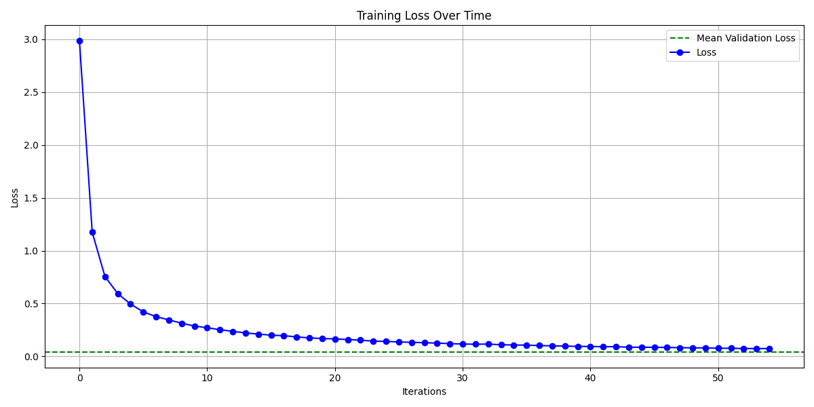
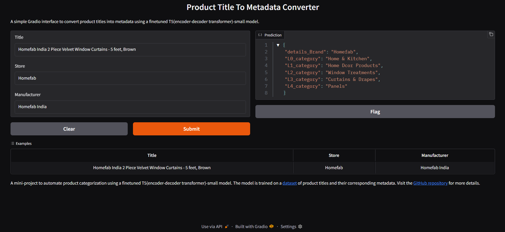

# 🛍️ T5-Small Product Metadata Generator

This repository contains a fine-tuned T5-small model designed to automate product metadata generation for e-commerce platforms. It simplifies the manual, time-consuming process of product categorization by predicting structured data like brand and hierarchical category levels (L0–L4) from basic product details.

## 🧠 Model Overview

- Base Model: [T5-Small](https://huggingface.co/google-t5/t5-small)
- Dataset Link: [Dataset](https://huggingface.co/datasets/SurAyush/ProductTitle-To-Category)
- Training: 1 epoch on ~440K examples
- Validation: ~60K examples
- Frameworks: PyTorch, Hugging Face Transformers, Datasets, Accelerate

For more training details refer to notebooks directory of refer which has two .ipynb notebooks for training and dataset creation (from existent datasource)

## 🎯 Objective

Manual product categorization is a resource-intensive task on e-commerce platforms. 

Inputs:
- Product Title
- Manufacturer
- Store

Outputs:
- Brand
- L0 to L4 Category Levels (hierarchical classification)

The output is returned in a structured JSON format via a custom post-processing function.

## 📊 Training Snapshot

## 🚀 Gradio Demo

An interactive Gradio app is included for testing and demo purposes.
It integrates preprocessing and postprocessing pipelines.

🖼️ Gradio UI Preview

## 🤗 Model Access

You can find and use the trained model on Hugging Face:
🔗 [Hugging Face Model Link](https://huggingface.co/SurAyush/title2metadata)

## 🧰 Tools Used

- PyTorch
- transformers (Hugging Face)
- Datasets (Hugging Face)
- Accelerate (Hugging Face)

## 💡 Learning Experience

This project was a great learning journey—from fine-tuning and evaluation to deployment and UI creation. There's still room for improvement, and I welcome all feedback and contributions.

## 🤝 Contributions

Feedback, issues, and pull requests are highly appreciated! Let’s make product metadata automation better together.
